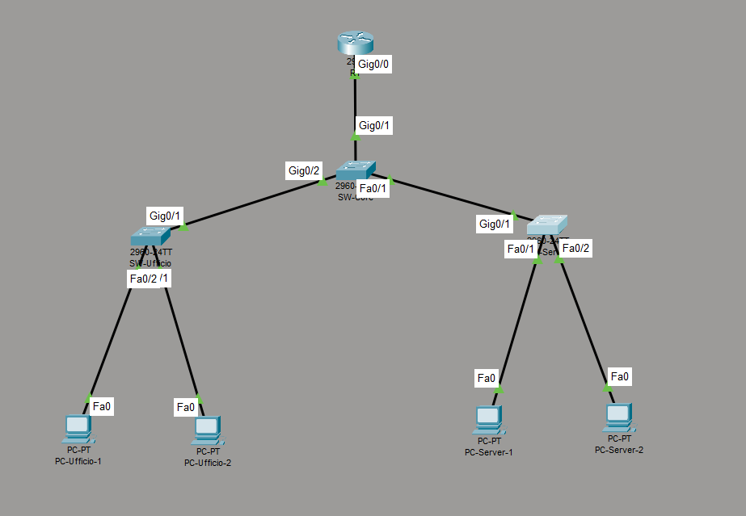
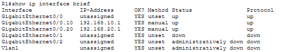
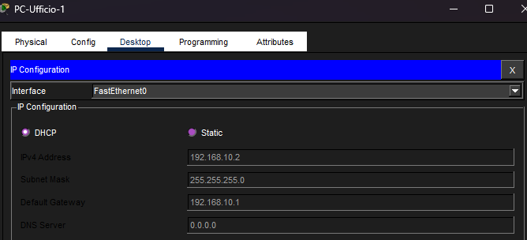

# Router-on-a-Stick - Segmentazione di Rete con VLAN

## Obiettivo
Simulare una rete aziendale con due segmenti separati (Ufficio e Server)
usando VLAN e un singolo router per il routing inter-VLAN.

## Topologia
- 1 Router (R1)
- 1 Switch Core (SW-Core)
- 1 Switch Ufficio (SW-Ufficio) - VLAN 10
- 1 Switch Server (SW-Server) - VLAN 20
- 4 PC (2 per VLAN)

## Schema IP

| Dispositivo     | IP             | VLAN |
|-----------------|----------------|------|
| PC-Ufficio-1    | 192.168.10.2   | 10   |
| PC-Ufficio-2    | 192.168.10.3   | 10   |
| PC-Server-1     | 192.168.20.2   | 20   |
| PC-Server-2     | 192.168.20.3   | 20   |
| Gateway VLAN 10 | 192.168.10.1   | 10   |
| Gateway VLAN 20 | 192.168.20.1   | 20   |

## Concetti chiave

### Perche le VLAN?
Le VLAN separano il traffico a livello logico anche su una rete fisica condivisa.
I PC nella VLAN 10 non possono comunicare con quelli nella VLAN 20 senza passare dal router.

### Cos e Router-on-a-Stick?
Tecnica che permette il routing inter-VLAN usando una sola interfaccia fisica del router,
divisa in sottointerfacce virtuali - una per ogni VLAN. Il traffico viaggia taggato (802.1Q)
su un link trunk verso lo switch core.

### Switch vs Router
Lo switch lavora a livello 2 (MAC address) e gestisce il traffico dentro la stessa VLAN.
Il router lavora a livello 3 (IP) ed e l unico che puo instradare traffico tra VLAN diverse.

## Strumenti
- Cisco Packet Tracer
- Protocollo 802.1Q (trunk)
- Routing inter-VLAN con sottointerfacce

## DHCP

Il router R1 funge da server DHCP per entrambe le VLAN.
Gli indirizzi vengono assegnati automaticamente ai PC al momento della connessione.

| Pool | Network | Gateway | Range assegnabile |
|------|---------|---------|-------------------|
| VLAN10-Ufficio | 192.168.10.0/24 | 192.168.10.1 | .2 - .254 |
| VLAN20-Server | 192.168.20.0/24 | 192.168.20.1 | .2 - .254 |

Il gateway e escluso dal pool con il comando `ip dhcp excluded-address`
per evitare conflitti di indirizzamento.

